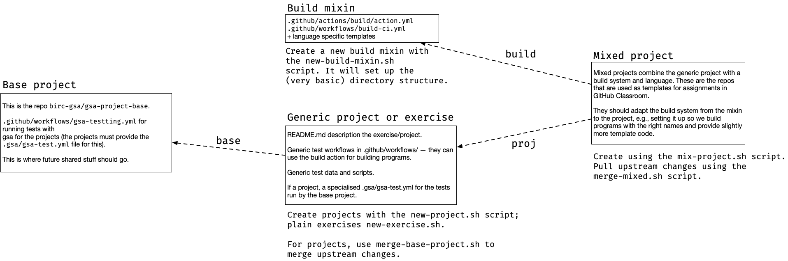

# gsa-classroom-tools

Tools for working with GSA projects with GitHub Classroom.

You might want to check out all the repos in this organisation, since you will be working with almost all of them. You can do this with a command line like:

```fish
gh repo list -L500 birc-gsa | while read repo _ ; gh repo clone $repo $repo; end
```

for `fish` or 

```bash
gh repo list -L500 birc-gsa | while read -r repo _ ; do gh repo clone $repo $repo; done
```

for `bash`.


## Structure of GSA repos

Since we allow students to choose different languages for the projects, and because they still have to do the same exercises and projects, the structure of these repositories is a little messy. We use some repositories for generic stuff, like exercise and project descriptions, and others for setting up the build environment for each of these. (Trying to have the students set up stuff that will work with testing workflows is doomed to failure, so we need to do this before they get the assignments). We then have concrete exercises and projects that mix a problem description with a build environment, that can pull the generic stuff from remote repos, and these we can use in GitHub Classroom for assignments.

There is a base project repository containing a few template workflow files:

```
.github/workflow/classroom.yml
```

that runs the testing framework when repos are pushed to GitHub. This will run language-specific actions

```
.github/actions/build
.github/actions/unit-test
```

 that are not part of the base repo but part of the language mixins.

 It will also optionally run

 ```
 .gihtub/actions/project-test (testing project specific stuff)
 .github/actions/gsa-test (run the gsa tool for comparing searches)
 ```

 but only if the corresponding `actions.yml` files are found. The base repository contain (disabled) templates for these. They should be edited to make concrete projects, that can then be merged with the language mixins.




## Setting up projects

To set up a new project, use the `new-project.sh` script. It will automatically do the steps described below. However, if you want to do them manually, you can just follow the instructions.

This [`gsa-project-base`](https://github.com/birc-gsa/gsa-project-base) repo collects common code and information shared between all projects. To use it, you need to build a specific one. To do that, first create a new repository and clone it to your own machine. There isn't a README.md file in this repository, so you can add that to the project repo, but you should not add a .gitignore, as that should come from the build-specific mixin.

In the new project repo, we need to setup a remote pointer to this base repo.

```sh
> git remote add base https://github.com/birc-gsa/gsa-project-base
> git fetch base
> git merge base/main --allow-unrelated-histories
```

Now you have a connection to the base-repo so you can fetch and merge updates in the future. Any time you need to pull down changes from the base repo, repeat

```sh
> git fetch base
> git merge base/main
```

In the new project, you can describe the specific project; use README.md for that, and you can configure the testing setup specific to the project. This can involve editing the `.github/actions/project-test` framework of the `.github/actions/gsa-test` framework. For the latter, you also want to add a `.gsa/test-test.yml` file to specify how `gsa` should run its tests. An example file could look like this:

```yaml
tools:
  TM-Naive:
    map: "gsa search {genome} {reads} -o {outfile} exact naive"
  TM-Border:
    map: "gsa search {genome} {reads} -o {outfile} exact border"
  search:
    map: "{root}/search {genome} {reads} > {outfile}"
  
reference-tool: TM-Naive

genomes:
  length: [100, 500, 1000]
  chromosomes: 10

reads:
  number: 10
  length: [10, 50]
  edits: 0
```

A project can't be used on its own. You need to combine it with a build mixin that sets up the necessary templates for building code and testing it.

## Setting up build mixins

A build mixin repo should be named `build-<configuration>-mixin` and should contain a build action in `.github/actions/build/action.yml`, e.g.

```yaml
name: 'Configure and build'
description: 'Setting up and building the project'
runs:
  using: "composite"
  steps:
    - name:  Building project files
      run:   make
      shell: bash
```

plus a unit test action, for example something like

```yaml
name: Language specific unit tests
description: Run C/CMake unit tests
runs:
  using: composite
  steps:
    - name: Checking
      run:  make test
      shell: bash
```

In addition to this, it could contain some minimal setup for building for this environment. This isn't strictly necessary, since we likely will have to adapt it for each project anyway. But still...

You can create a repo with a template using `new-build-mixin.sh`.


## Creating a concrete project

When you have both a project and a build mixin you can create a repo you can use for assignment templates using the `mix-project.sh` script.

Run it as

```sh
> mix-project.sh project-name build-mixin
```

where `build-mixin` doesn't contain the `build-` and `-mixin` part.

Run it from outside an existing repo clone because it will create a new dir and a repository in it. You will have to make it a template yourself, because I don't know how to do that on the command-line.

From this project repo you can fetch new project data from `proj/main` and new build data from `build/main`.

If you need to update a mixed project, you can use the `merge-mixed.sh` script to automatically fetch and merge from the build mixin and the generic project.


## Setting up a new class

When you are about to run a new class, create a new organisation for it (that way you can handle repos and administration access separately year for year). For year 20xx, create birc-gsa-20xx, for example.

In that repo, go to Settings > Member privilages and change Base permissions to Read. Otherwise, the students cannot invite each other to review (and it is nice to get them to do that).

Then, setup a GitHub Classroom and all the exercises--I don't think you can automate this, unfortunately.
